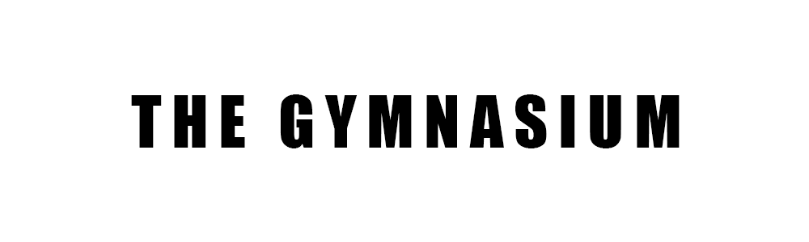

  

 
 
The gymnasium serves as a platform where I share guides and solutions for security, software, cloud, and devops challenges, allowing both you and me to refer back to them for solutions. 

**This is why I created this project**.

[Projects](#projects) •
[Key Features](#key-features) •
[How to make use](#how-to-make-use) •
[Technologies Used](#technologies-used)

## Projects

<b>Projects 001 - Security Challenges </b>

<ul>  

<b>Security 001 - Boot2root </b>

  <!--1. [``Malware Analysis 001 - Nasef's Keep Spreading #1 (Reading Lines)``](https://github.com/iamnasef/nks-readinglines) is a vulnerable machine build to showcase the strings utility tool.-->

  

</ul>

## Key Features

- The gymnasium platform offers a diverse collection of solution of challenges which spans multiple disciplines and technologies.
- Each project is a markdown file, the markdown file contains images and step by step illustrating the solution process.
- These projects serve as valuable resources for enriching your understanding.
- Furthermore, social media are available to facilitate discussions and exchange ideas with fellow learners, fostering a collaborative learning environment.

## How to make use

1. Carefully review the project description and endeavor to solve it independently.
2. Conduct a thorough comparison between your solution and the solution available in the gymnasium.
3. Explore any embedded videos accompanying each project, if available, illustrating a step-by-step guide on how to solve it. 
4. Feel free to reach out to me should you have any questions or concerns.

## Technologies Used

This is the list of technologies used in the project

| Application                                         | Description                                  
| --------------------------------------------------- |---------------------------------------------          
| [Markdown](https://www.markdownguide.org/)                           | A lightweight markup language for creating formatted text using a plain-text editor language                 